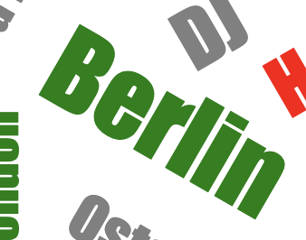
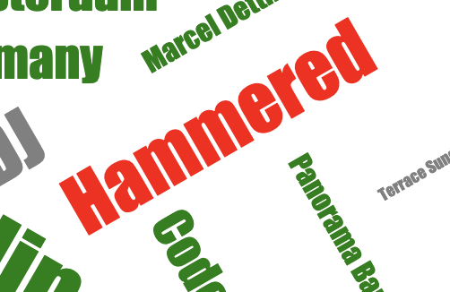
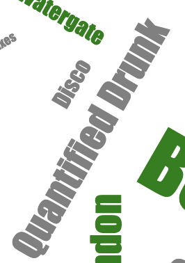

# Manual test

The purpose here is to test the outcome of using the library based on the logic inserted for the word color

## Test: words with sentiment score > 60 should have color green

### Expected outcome

Berlin has a sentiment score of 65, Berlin should have color green

### Test outcome

Berlin has color green :white_check_mark:

## Test: words with sentiment score < 40 should have color red

### Expected outcome

Hammered has a sentiment score of 20, Hammered should have color red

### Test outcome

Hammered has color red :white_check_mark:

## Test: words with sentiment score > 40 and < 60 should have color grey

### Expected outcome

Quantified Drunk has a sentiment score of 50, Hammered should have color red

### Test outcome

Quantified Drunk has color grey :white_check_mark:

